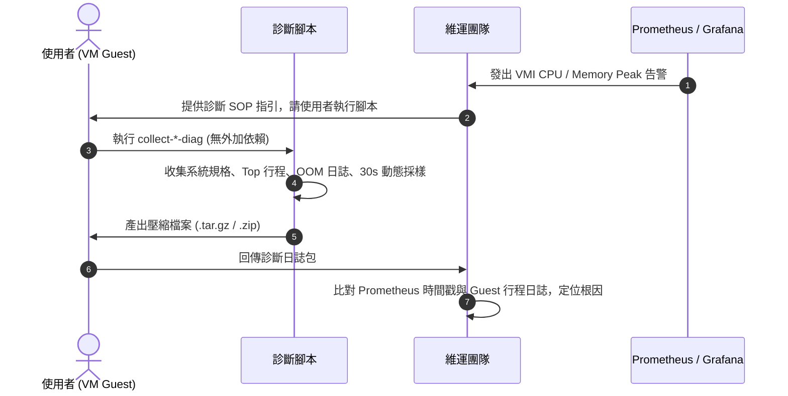

# KubeVirt Guest CPU / Memory 異常診斷 SOP (Linux & Windows)

本文件提供在 **KubeVirt** 生產環境下，因資安隔離規範「維運團隊無法登入使用者 VM」時，排查 **CPU / Memory 飆高（Peak）** 的標準作業程序（SOP）與專用診斷腳本。

---

## 背景與問題挑戰

在 KubeVirt 環境中，維運團隊通常只能透過 Prometheus 監控虛擬化層（Hypervisor / cgroup）的指標：

*   `kubevirt_vmi_cpu_usage_seconds_total`
*   `kubevirt_vmi_memory_resident_bytes` (RSS)
*   `kubevirt_vmi_memory_available_bytes` (需依賴 Guest Agent)

### 監控盲點

1.  **黑盒子問題**：虛擬化層指標只能看到 VM「總體」吃了多少 CPU 或 RAM，無法得知 Guest 內部究竟是哪一個行程（PID）、指令行、或是哪位使用者觸發。
2.  **記憶體誤判**：Linux 的 Page Cache 或 Windows 的 Working Set 機制可能使 Hypervisor 觀測到的 RSS 長期維持高檔，但 Guest 內部可用記憶體（Available Memory）實際上仍充裕。
3.  **無法直接登入**：基於資安合規與多租戶權限分離，維運人員無法直接 SSH 或 RDP 進入使用者虛擬機進行 `top` 或檢視工作管理員。

### 解決方案架構

維運團隊提供免安裝依賴、開箱即用的診斷腳本。當使用者回報資源飆高或觸發監控告警時，請使用者在 VM 內執行腳本，腳本將自動收集瞬間快照與 30 秒動態採樣，並打包成單一壓縮檔回傳。



---

## Linux VM 診斷 SOP

### 使用者操作步驟

1.  **下載 / 取得腳本**：
    在 VM 終端機執行以下指令下載腳本（或手動建立腳本檔案）：
    ```bash
    curl -fsSL https://raw.githubusercontent.com/MansionLai/ops-knowledge-base/main/scripts/guest-diag/collect-linux-diag.sh -o collect-linux-diag.sh
    chmod +x collect-linux-diag.sh
    ```

2.  **執行診斷收集**：
    建議使用 `sudo` 權限執行，以利完整取得 `dmesg` 內核日誌與 `journalctl` 系統日誌：
    ```bash
    sudo ./collect-linux-diag.sh
    ```
    *若希望延長動態採樣時間（例如觀察 60 秒），可在後面加上秒數：*
    ```bash
    sudo ./collect-linux-diag.sh 60
    ```

3.  **產出檔案**：
    腳本執行完畢後會顯示打包檔案路徑：
    ```text
    /tmp/vm_diag_<hostname>_<timestamp>.tar.gz
    ```
    請使用者將此 `.tar.gz` 檔案回傳給維運團隊。

---

## Windows VM 診斷 SOP

### 使用者操作步驟

1.  **以系統管理員身分開啟 PowerShell**：
    按下鍵盤 `Win + X`，選擇「**Windows PowerShell (系統管理員)**」或「**Terminal (以系統管理員身分執行)**」。

2.  **取得腳本**：
    在 PowerShell 視窗執行：
    ```powershell
    Invoke-WebRequest -Uri "https://raw.githubusercontent.com/MansionLai/ops-knowledge-base/main/scripts/guest-diag/collect-windows-diag.ps1" -OutFile "$env:TEMP\collect-windows-diag.ps1"
    ```

3.  **執行診斷收集**：
    執行腳本（若遇到執行原則限制，請加入 `-ExecutionPolicy Bypass`）：
    ```powershell
    powershell.exe -ExecutionPolicy Bypass -File "$env:TEMP\collect-windows-diag.ps1"
    ```
    *若希望動態採樣 60 秒：*
    ```powershell
    powershell.exe -ExecutionPolicy Bypass -File "$env:TEMP\collect-windows-diag.ps1" -SampleDurationSeconds 60
    ```

4.  **產出檔案**：
    腳本執行完畢後，會在暫存目錄生成 ZIP 檔案：
    ```text
    C:\Users\<User>\AppData\Local\Temp\vm_diag_<ComputerName>_<timestamp>.zip
    ```
    請使用者將此 `.zip` 檔案回傳給維運團隊。

---

## 診斷收集內容清單

腳本打包的檔案中包含以下關鍵資訊：

| 檔案名稱 (Linux / Windows) | 收集內容與目的 |
| :--- | :--- |
| `system_info.txt` | OS 版本、內核版本、vCPU 核心數、實體記憶體總量、開機運行時間、**QEMU Guest Agent 狀態** |
| `process_snapshot.txt` | 執行當下 CPU 佔用前 30 名與記憶體佔用前 30 名的行程（包含 PID, Command/Path, RSS/WorkingSet） |
| `sampling_30s.txt` | 連續 30 秒（每 5 秒一次）的動態取樣，記錄 CPU 總負載、剩餘記憶體及該瞬間前 5 名行程，用於捕捉突發峰值 |
| `oom_and_kernel_alerts.txt` / `event_logs.txt` | **Linux**: `dmesg` 搜尋 OOM Killer、Page Fault、硬體節流。<br>**Windows**: 搜尋 Event ID 2004（Resource-Exhaustion-Detector 低記憶體警告）及 System/App 錯誤 |
| `memory_details.txt` | **Linux**: `free -h` 與 `/proc/meminfo`（分析 AnonPages、Buffers/Cached、Slab 佔用） |
| `disk_io.txt` / `disk_info.txt` | 磁碟空間使用量與 I/O 統計（判斷是否因磁碟寫滿或 I/O 瓶頸引發高負載） |

---

## 維運團隊分析手冊 (Ops Troubleshooting Playbook)

收到使用者提供的診斷封裝包後，請依循以下步驟進行交叉比對：

### 步驟 1：時間軸對齊
*   將 Prometheus 告警時間（如 `2026-09-06 13:30:00 UTC`）與 `system_info.txt` 中的 UTC / 本地時間進行校準。
*   確認使用者執行腳本時是否仍處於 Peak 狀態，或是在 Peak 結束後收集。

### 步驟 2：OOM (Out Of Memory) 檢查
*   **Linux**:
    開啟 `oom_and_kernel_alerts.txt` 或 `dmesg_full.txt`，搜尋關鍵字：
    ```text
    Out of memory: Killed process <PID> (<process_name>)
    invoked oom-killer: gfp_mask=...
    ```
    確認是哪支行程佔用最多 `anon-rss` 導致觸發內核 OOM-Killer。
*   **Windows**:
    開啟 `event_logs.txt`，檢查是否有 **Event ID 2004**：
    > *Windows successfully diagnosed a low virtual memory condition. The following programs consumed the most virtual memory: ...*
    Windows 會直接在該日誌中列出前三名吃光分頁記憶體的程式名稱。

### 步驟 3：CPU 佔用型態分析
比對 `process_snapshot.txt` 與 `sampling_30s.txt`：
1.  **持續型高負載**：特定行程持續維持在單核 100% 或多核吃滿（如自建腳本死迴圈、密集計算、Java GC 頻繁）。
2.  **短暫尖峰（Spike）**：`sampling_30s.txt` 中負載忽高忽低，常見於 Cron 排程作業、日誌壓縮、Windows Defender 快速掃描、或是 Windows Update 背景安裝。
3.  **假性 CPU 高負載（I/O Wait 瓶頸）**：
    *   在 Linux 的 `sampling_30s.txt` 中檢視 `vmstat` 的 `wa`（wait）欄位。
    *   若 `wa` 很高而 `us`（user）很低，代表不是算力不足，而是底層儲存（Ceph RBD / PVC）I/O 延遲過高，導致 CPU 在等待磁碟讀寫。

### 步驟 4：記憶體架構深入分析 (Linux)
檢視 `memory_details.txt` 內的 `/proc/meminfo`：
*   **Active(anon) + Inactive(anon)** 高：代表是使用者行程（User-space Application）真實分配並持有的實體記憶體。
*   **Cached / Buffers** 高：代表是 Linux 檔案系統快取，有需要時內核會自動回收，此為正常現象，非記憶體洩漏。
*   **SReclaimable / SUnreclaim (Slab)** 高：若 `SUnreclaim` 異常巨大，代表可能是內核模組或網路 Socket 洩漏。

### 步驟 5：QEMU Guest Agent 狀態檢查 (關鍵！)
檢查 `system_info.txt` 中的 `qemu-guest-agent` 服務狀態：
> [!IMPORTANT]
> 若 VM 內**未安裝**或**未啟動** `qemu-guest-agent`，KubeVirt 與 Prometheus 無法取得 Guest 內部精確的 `memory_available` 與 `memory_usable`。
> 監控系統看到的往往只是 Hypervisor 分配給 Pod 的完整 RSS 額度，容易產生「記憶體一直維持在 90%~100%」的**假性警報**。

---

## 腳本原始碼

### Linux 收集腳本 (`collect-linux-diag.sh`)
完整腳本位於儲存庫 [`scripts/guest-diag/collect-linux-diag.sh`](https://github.com/MansionLai/ops-knowledge-base/blob/main/scripts/guest-diag/collect-linux-diag.sh)。

### Windows 收集腳本 (`collect-windows-diag.ps1`)
完整腳本位於儲存庫 [`scripts/guest-diag/collect-windows-diag.ps1`](https://github.com/MansionLai/ops-knowledge-base/blob/main/scripts/guest-diag/collect-windows-diag.ps1)。
